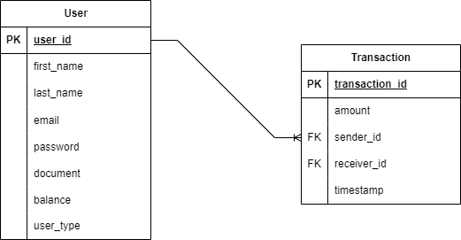

### Project Requirements

- [X] R1 - There will be two types of users, both need full name, CPF/CNPJ, email and passsword. CPF/CNPJ and emails must be unique in the system. Therefore, the system must only allow one registration with the same CPF or email address.

- [X] R2 - Users can send money (transfer) to shopkeepers and between users.

- [X] R3 - Shopkeepers *only receive* transfers, they do not send money to anyone.

- [X] R4 - There must be validation so that the user has a valid balance before perform the transfer.

- [ ] R5 - Before finish the transfer, the system must consult an external authorizing service, use this mock to simulate: https://run.mocky.io/v3/5794d450-d2e2-4412-8131-73d0293ac1cc

- [ ] R6 - The transfer operation must be a transaction (i.e. reversed in any case of inconsistency) and the money must return to the wallet of the sending user.

- [ ] R7 - After receiving the payment, the user or shopkeeper must receive a notification (email, SMS) sent by a third-party service and this service may eventually become unavailable/unstable. Use this mock to simulate: https://run.mocky.io/v3/54dc2cf1-3add-45b5-b5a9-6bf7e7f1f4a6

### Data Modeling

### Technical specifications
- Data Modeling
- RESTFul Architecture
- Security Features
- Design Patterns
- SOLID
- Unit Tests
- Integration Tests
- Docker